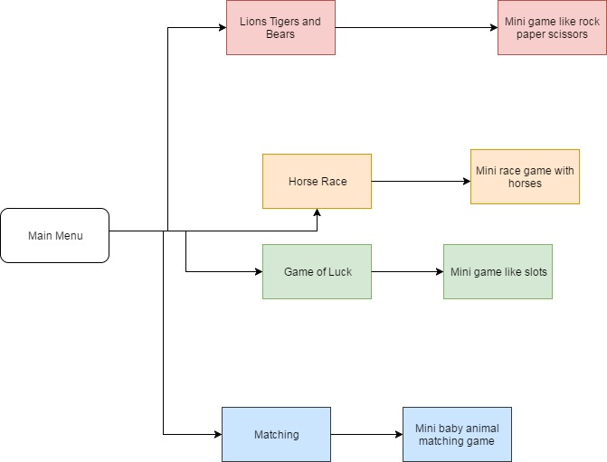

# Final

<h2>Animal Games</h2>
  Animal games is a program with five different games all related to animals. Our first game is an average of your pets in your house which you complete by answering a series of questions. Our second game is a horse race, you click a button and the horses race it keeps score of each horse and how many times they won. Our third game is called lions tigers bears, is it similar to the common game rock paper scissors, you pick an animal and the computer also picks an animal, and depending on the animal picked you or the computer wins, it also keeps score for both you and the computer. Our fourth game is a random animal generator, you click a button and the computer tells you what animal you are and if you're lucky or not. Our fifth game is an array of users favorite animals. 
<h3>Software</h3>
  You need github to download our program, you can download the desktop version or go to our online website. 
